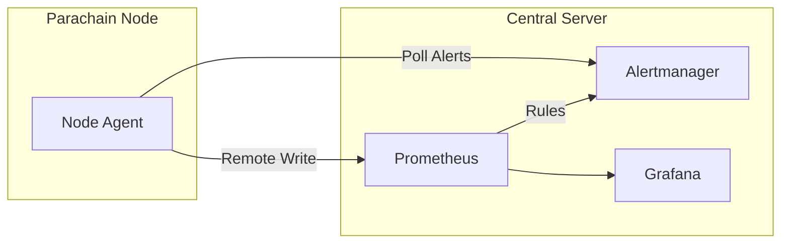

# Kreivo Monitoring System

This repository contains the complete infrastructure for monitoring Kreivo parachain nodes. It consists of two main components:

1.  **Node Agent** (`node/`): A lightweight, resilient Rust binary that runs on each parachain node. It scrapes local metrics, handles identity, and pushes data to the central server.
2.  **Central Infrastructure** (`central/`): Configuration for the centralized monitoring stack (Prometheus, Alertmanager, Grafana) that receives data from all nodes.

## Repository Structure

-   **`node/`**: Source code and deployment files for the **Kreivo Monitor Agent**.
    -   `kreivo-monitor/`: Rust source code.
    -   `Dockerfile`: For containerized builds.
    -   `config.yaml`: Agent configuration.
    -   `kreivo-monitor.service`: Systemd unit file.
    -   [Read more](node/README.md)
-   **`central/`**: Configuration for the central monitoring servers.
    -   `prometheus.yml`: Central Prometheus config (scrape jobs, rule files).
    -   `alerts.yml`: Prometheus alerting rules.
    -   `alertmanager.yml`: Alertmanager routing and receiver config.
    -   `grafana/`: Grafana provisioning files.
-   **`docker-compose.yml`**: A local development stack that spins up Prometheus, Alertmanager, and Grafana for testing.

## Architecture

The system is designed to monitor firewalled nodes by having them push metrics out to a central server.



## Quick Start (Local Development)

To spin up the entire system locally for testing:

1.  **Start Central Stack**:
    ```bash
    docker-compose up -d
    ```
    -   Prometheus: `http://localhost:9091`
    -   Alertmanager: `http://localhost:9093`
    -   Grafana: `http://localhost:3000` (admin/admin)

2.  **Run Node Agent**:
    ```bash
    cd node/kreivo-monitor
    cargo run -- --config ../config.yaml
    ```

For detailed documentation on the agent, see [node/README.md](node/README.md).
