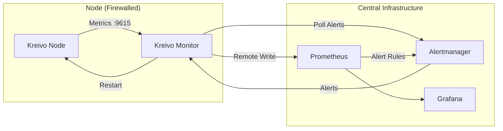

# Kreivo Monitor

A resilient, resource-efficient monitoring agent for Kreivo parachain nodes.

## Overview

`kreivo-monitor` is a Rust-based agent designed to run alongside Kreivo parachain nodes. It solves the problem of monitoring nodes behind firewalls (NAT) by:
1.  **Scraping** local Prometheus metrics from the node.
2.  **Pushing** metrics to a central Prometheus server via Remote Write.
3.  **Polling** a central Alertmanager for specific alerts (e.g., "Node Stuck").
4.  **Remediating** issues automatically (e.g., restarting the service).

## Features

-   **Single Binary**: No external dependencies (Python, Prometheus Agent, etc. are replaced).
-   **Resource Efficient**: Written in Rust for minimal CPU/RAM usage.
-   **Dynamic Identity**: Automatically extracts the node name from `substrate_build_info` and applies it as the `instance` label to all metrics.
-   **Resilient**: Buffers metrics in memory if the central server is unreachable.
-   **Secure**: Supports authentication for Remote Write.
-   **Configurable**: Fully configurable via YAML file and CLI arguments.
-   **Automated Remediation**: Can execute arbitrary commands (like `systemctl restart`) in response to alerts.

## Architecture



## Installation

### Option 1: Systemd (Recommended)

1.  **Download Release**: Get the latest binary from [GitHub Releases](https://github.com/virto-network/kreivo-monitor/releases).
2.  **Install Binary**:
    ```bash
    sudo cp kreivo-monitor /usr/local/bin/
    sudo chmod +x /usr/local/bin/kreivo-monitor
    ```
3.  **Configure**:
    ```bash
    sudo mkdir -p /etc/kreivo-monitor
    sudo cp config.yaml /etc/kreivo-monitor/
    # Edit /etc/kreivo-monitor/config.yaml
    ```
4.  **Install Service**:
    Copy `node/kreivo-monitor.service` to `/etc/systemd/system/`.
    ```bash
    sudo systemctl enable --now kreivo-monitor
    ```

### Option 2: Docker

```bash
docker run -d \
  --name kreivo-monitor \
  --network host \
  -v /etc/kreivo-monitor/config.yaml:/etc/kreivo-monitor/config.yaml \
  ghcr.io/virto-network/kreivo-monitor:latest
```
*Note: Host networking is recommended to easily access the local node metrics.*

## Configuration

The agent is configured via a YAML file (default: `/etc/kreivo-monitor/config.yaml`).

```yaml
scrape_url: "http://localhost:9615/metrics"
remote_write:
  - url: "http://central-prometheus:9090/api/v1/write"
    # auth_header: "Bearer <token>"
alertmanager_url: "http://central-alertmanager:9093"
actions:
  restart: "systemctl restart kreivo"
scrape_interval_seconds: 15
poll_interval_seconds: 30
```

### CLI Overrides

All configuration options can be overridden via CLI flags:

```bash
kreivo-monitor --config custom_config.yaml \
  --scrape-url http://localhost:9999/metrics \
  --scrape-interval-seconds 5
```

Run `kreivo-monitor --help` for all options.

## Development

### Prerequisites
-   Rust (latest stable)
-   Docker & Docker Compose

### Local Stack
You can run a full monitoring stack (Prometheus, Alertmanager, Grafana) locally:

```bash
docker-compose up -d
```

-   **Prometheus**: `http://localhost:9091`
-   **Alertmanager**: `http://localhost:9093`
-   **Grafana**: `http://localhost:3000` (admin/admin)

### Running the Agent
```bash
cd node/kreivo-monitor
cargo run -- --config ../config.yaml
```

## CI/CD

This repository uses GitHub Actions:
-   **Releases**: Pushing a tag `v*` (e.g., `v0.1.0`) builds the binary and uploads it to GitHub Releases.
-   **Docker**: The same workflow builds and pushes a Docker image to `ghcr.io`.
